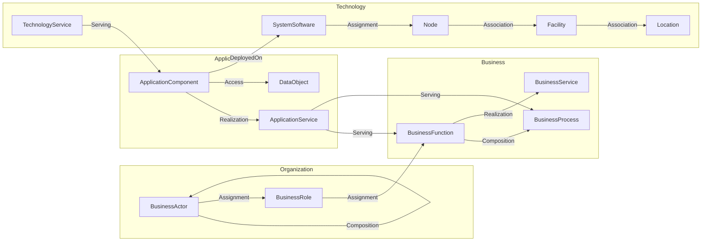

# Funkční specifikace — IT Map (Organization Architecture Editor)

**Verze:** 0.4  
**Datum:** 2026-09-04  
**Stav:** Draft (aktualizace package layout)

> **Aktuální layout modelů (září 2026):** Doménové bundly jsou v sibling repo [`knowledge-models`](../../knowledge-models/) (`kc-base` 1.1.0, `archimate-lite` 3.1.0, `archimate-ui-traversal` 1.0.0). UI traversal metadata **nejsou** součástí `archimate-lite`. Kapitoly níže o „vše v archimate-lite / knowledge-core“ popisují původní plán 2.1.0 — pro živý kontrakt navigace viz [`koncept-prochazeni-grafem.md`](koncept-prochazeni-grafem.md).

**Související dokumenty:**
- [`koncept-prochazeni-grafem.md`](koncept-prochazeni-grafem.md) — popis traversal templates, TraversalEngine a hranice kód vs. metadata
- [`archimate-lite-2.1.0-rozsireni-vycet.md`](archimate-lite-2.1.0-rozsireni-vycet.md) — checklist doménového rozšíření (historický)
- [`navrh-ui-konfiguracni-vrstvy.md`](navrh-ui-konfiguracni-vrstvy.md) — historický návrh UI konfigurační vrstvy

---

## 1. Účel dokumentu

Tento dokument specifikuje aplikaci pro **modelování organizace v plné hloubce** — od organizační struktury přes business a aplikační vrstvu až po deployment a fyzickou infrastrukturu — podle metodiky popsané v:

- [`koncept-metodiky a aplikace.md`](koncept-metodiky%20a%20aplikace.md) — principy UI, vrstvené procházení grafu, odvozování vztahů
- [`concept-modelovani-business-a-app.md`](concept-modelovani-business-a-app.md) — doménová pravidla, kontrolovaný slovník, mapování na ArchiMate

Aplikace je **doménově specializovaný editor** typu *Organization → Responsibility → Application → Infrastructure*, nikoli obecný ArchiMate kreslicí nástroj. Uživatel popisuje realitu v business jazyce; systém pod ním udržuje validní ArchiMate graf v **Knowledge Core (KC)**.

Dokument sloužil k **schválení konceptu**, rozsahu a implementačního plánu. Původní předpoklad (doménový release v `knowledge-core`) je splněn; modely se od té doby přesunuly do `knowledge-models`.

---

## 2. Vize a cíle

### 2.1 Vize

Jeden kanonický knowledge graph organizace v **plné modelovací hloubce**, prohlížený a editovaný přes **vrstvený column browser** s odvozenými vztahy, s možností doplnit libovolné atributy (open-world) a s plnou integrací na KC lifecycle (ChangeSet, Release).

Typická navigace zleva doprava (progressive disclosure):

```text
Organization
  → Person / Role
  → Business Function
  → Business Process
  → Business Service
  → Application Service
  → Application Component
  → System Software / Technology Service
  → Node
  → Device / Facility / Location
```

Uživatel nevidí celý graf — postupně odkrývá další vrstvu podle toho, co ho zajímá (kdo → za co → jak → kde to běží).

### 2.2 Cíle

| Priorita | Cíl |
|----------|-----|
| P0 | Procházet a editovat model organizace v **plné hloubce** (business → application → technology/infrastructure) |
| P0 | Základní pohled: typy, názvy, popisy, strukturální vazby |
| P0 | Detail: rozšířené atributy entit a vztahů (včetně upřesnění typu objektu a sémantiky vztahu) |
| P0 | Open-world režim: libovolná existující nebo nová property + hodnota |
| P0 | Práce s KC ChangeSet a Release pro data spravovaná aplikací |
| P0 | Traversal templates pro různé úhly pohledu (business, application impact, infrastructure) |
| P1 | Validace dle metodiky a `AllowedRelationship` z archimate-lite |
| P1 | Sekundární graph view, import/export ArchiMate Open Exchange |

### 2.3 Co aplikace není

- Obecný ArchiMate modeler s volným výběrem prvků a vztahů
- Source of truth mimo KC
- Workflow engine (ChangeSet audit ano, schvalovací workflow ne)
- Nástroj pro L5 konfiguraci (jednotlivé pody, všechny IP worker nodů, firewall rules) — viz granularita v archimate-lite

---

## 3. Metodický koncept (souhrn)

### 3.1 Doménový slovník (uživatelský jazyk)

Uživatel pracuje s těmito koncepty; ArchiMate typ je implementační detail zobrazený v inspektoru:

| Co uživatel přidává | ArchiMate třída | Upřesnění typu (property) |
|---------------------|-----------------|---------------------------|
| Organizační jednotka / tým | `BusinessActor` | `actorKind=organizationalUnit`, `organizationScope=internal` |
| Osoba | `BusinessActor` | `actorKind=person`, `organizationScope=internal` |
| Externí organizace | `BusinessActor` | `actorKind=organization`, `organizationScope=external` |
| Role / odpovědnost | `BusinessRole` | — |
| Oblast odpovědnosti | `BusinessFunction` | **doplnit do archimate-lite** |
| Konkrétní aktivita | `BusinessProcess` | — |
| Služba pro ostatní | `BusinessService` | volitelně |
| IT systém | `ApplicationComponent` | `ownership` (internal/external) |
| Funkcionalita systému | `ApplicationService` | — |
| Aplikační data | `DataObject` | `dataClass`, … |
| Platformní služba | `TechnologyService` | např. DB, DNS, IdP |
| Runtime / middleware | `SystemSoftware` | např. Kubernetes, PostgreSQL |
| Uzel / cluster / VM | `Node` | `environment`, `site`, … |
| Fyzické zařízení | `Device` | — |
| Datacentrum / areál | `Facility` | — |
| Geografická lokace | `Location` | — |
| Síť | `CommunicationNetwork` | `cidr`, `zone`, … |

### 3.2 Povolené vztahy (metodika)

| Uživatelská akce | ArchiMate vztah | Směr v modelu | Upřesnění vztahu |
|------------------|-----------------|---------------|------------------|
| Jednotka obsahuje jednotku/osobu | `Composition` | parent → child | — |
| Osoba/role vykonává funkci/proces | `Assignment` | actor/role → function/process | — |
| Funkce obsahuje proces | `Composition` | function → process | — |
| Funkce/proces realizuje službu | `Realization` | function/process → service | — |
| App service podporuje business | `Serving` | app service → function/process | — |
| App component realizuje app service | `Realization` | component → service | — |
| App component přistupuje k datům | `Access` | component → data object | `accessMode` |
| Mezi komponentami teče data | `Flow` | source → target | **`flowLabel` povinné** |
| Proces A spouští proces B | `Triggering` | A → B | — |
| Aplikace běží na platformě | `DeployedOn` | component → system software | — |
| Software běží na uzlu | `Assignment` | system software → node | — |
| Tech služba podporuje aplikaci | `Serving` | tech service → component | — |
| Uzel v areálu / síti | `Association` | node → facility/network | volitelně `associationKind` |
| Osoba A reportuje B | `Association` | person → person | **`associationKind=reportsTo`** |
| Osoba A zastupuje B | `Association` | person → person | **`associationKind=deputizesFor`** |
| Výjimka | `Association` | — | `associationKind` dle kontextu |

**Princip UI:** uživatel nevybírá typ vztahu ze seznamu ArchiMate relations — aplikace ho odvodí z kontextu (WHO / WHAT / SUPPORT / WHERE).

### 3.3 Navigační vs. technická sémantika

Směr procházení obrazovky nemusí odpovídat směru ArchiMate vztahu:

| Vztah v modelu | Směr v UI |
|--------------|-----------|
| `ApplicationService` —Serving→ `BusinessProcess` | Process → „Supported by“ → App Service |
| `TechnologyService` —Serving→ `ApplicationComponent` | App Component → „Depends on“ → Tech Service |
| `ApplicationComponent` —DeployedOn→ `SystemSoftware` | App Component → „Runs on“ → System Software |

Uložení vždy respektuje ArchiMate směr; zobrazení odpovídá uživatelské otázce.

### 3.4 Granularita modelování

Aplikace respektuje granularitu L0–L4 dle archimate-lite (`modelingDepth`). Sloupce infrastruktury se zobrazí až po výběru aplikační komponenty; hloubka detailu závisí na `modelingDepth` a kritičnosti objektu (`criticality`).

---

## 4. Datový model v Knowledge Core

### 4.1 Vrstvy a packages

```text
┌─────────────────────────────────────────────────────────────┐
│ kc-base (release 1.1.0)          — foundation, instanceOf   │
├─────────────────────────────────────────────────────────────┤
│ archimate-lite (release ≥ 3.1.0) — ArchiMate + org metodika │
│   BusinessFunction, actorKind, associationKind, …           │
├─────────────────────────────────────────────────────────────┤
│ archimate-ui-traversal (≥ 1.0.0) — IT Map navigační profil  │
│   UiNavigationProfile, UiStage, UiTransition, …             │
├─────────────────────────────────────────────────────────────┤
│ org-{code} (continuous)          — instance organizace      │
│   entity + statementy modelu                                  │
└─────────────────────────────────────────────────────────────┘
```

| Package | lifecycle | Obsah |
|---------|-----------|-------|
| `kc-base` | import bundle | Typing, StringEnum, usage anotace |
| `archimate-lite` | `released` | Třídy, properties, AllowedRelationship, shapes, enumy |
| `archimate-ui-traversal` | `released` | UI traversal slovník + systémový seed profil |
| `org-{tenant}` | `continuous` | Konkrétní model organizace |

Bundly a catalogy: repo **`knowledge-models`** (Go služba `knowledge-core` je runtime). Doménová metodika zůstává v `archimate-lite`; navigační metadata jsou **samostatný** package.

Závislost instance package:

```json
{
  "code": "org-ote",
  "lifecycle": "continuous",
  "iriBase": "https://example.org/org/ote/",
  "dependencies": [
    { "dependsOnCode": "archimate-lite", "versionRange": "^3.1.0" },
    { "dependsOnCode": "archimate-ui-traversal", "versionRange": "^1.0.0" }
  ]
}
```

### 4.2 Předpoklad: archimate-lite ≥ 3.1.0 + archimate-ui-traversal ≥ 1.0.0

Aplikace **vyžaduje** `archimate-lite` **3.1.0+** (doména bez UI metadat; BusinessActor: `actorKind` + `organizationScope`) a **`archimate-ui-traversal` 1.0.0+** (navigační profil). Doménový checklist 2.1.0 je v [`archimate-lite-2.1.0-rozsireni-vycet.md`](archimate-lite-2.1.0-rozsireni-vycet.md) (historicky implementován; aktuální release je 3.1.0).

### 4.3 Reprezentace prvků a vztahů v KC

**Prvek (element):**

```text
POST /v1/entities  { packageCode, labels, iriLocal, descriptions }
POST /v1/statements  subject → instanceOf → BusinessFunction
POST /v1/statements  subject → actorKind → "organizationalUnit"
POST /v1/statements  subject → organizationScope → "internal"
```

**Vztah (first-class entita, Wikibase pattern):**

```text
rel-1  instanceOf → Assignment
rel-1  relSource  → Q:dpo-role
rel-1  relTarget  → Q:data-protection-fn
```

**Association s upřesněním sémantiky:**

```text
rel-2  instanceOf → Association
rel-2  relSource  → Q:petr-novak
rel-2  relTarget  → Q:jiri-kreuzman
rel-2  associationKind → "reportsTo"
```

Identita vztahu = IRI entity vztahu. UI zobrazuje hranu mezi prvky; persistuje first-class entitu dle archimate-lite konvence.

### 4.4 Open-world properties

KC nativně podporuje open-world model:

1. **Existující property** (z archimate-lite) — statement na entitě/vztahu
2. **Nová property** — `POST /v1/properties` v package `archimate-lite` (additive release) nebo v `org-{code}` pro tenant-specific data

Aplikace v režimu „Rozšířený pohled“:

- nabídne properties s `domainClasses` odpovídajícími typu objektu
- umožní „+ Nová property“ → dialog → zápis do metamodelu (archimate-lite release) nebo instance package
- nové property v `archimate-lite` vyžadují additive release před propagací do jiných prostředí

---

## 5. Zadání pro doplnění archimate-lite (historické)

> **Historické zadání pro doménový release 2.1.0.** Dnes žije v `knowledge-models/archimate-lite` (aktuálně **3.0.0**). UI traversal sem **nepatří** — viz `archimate-ui-traversal`.  
> **Autoritativní checklist:** [`archimate-lite-2.1.0-rozsireni-vycet.md`](archimate-lite-2.1.0-rozsireni-vycet.md) (~51 additive položek včetně network/flow).

### 5.1 Cíl

Rozšířit package `archimate-lite` o prvky potřebné pro **modelování organizace v plné hloubce** dle metodiky IT Map, zpětně kompatibilně (additive changes) vůči release **2.0.0**.

| Parametr | Hodnota |
|----------|---------|
| Cílová verze | **2.1.0** (tehdy; dnes supersedováno 3.0.0) |
| Repozitář | tehdy `knowledge-core` → dnes **`knowledge-models`** |
| Artefakty | `archimate-lite/catalog.json`, `build_bundle.py`, release bundle, `load.py`, dokumentace |
| Typ změn | Additive (nové třídy, properties, enumy, AllowedRelationship, shapes) |
| Breaking changes | **Ne** — stávající instance a nástroje na 2.0.0 musí zůstat validní |

### 5.2 Nové třídy prvků

| `iriLocal` | `subClassOf` | `archiLayer` | Účel |
|------------|--------------|--------------|------|
| `BusinessFunction` | `ArchiMateElement` | `business` | Stabilní oblast odpovědnosti / práce; primární dekompozice business vrstvy |

**Poznámka:** Třída `BusinessFunction` je v ArchiMate specifikaci standardní business prvek. Jeho absence v `archimate-lite-2.0.0` je mezera vůči metodice i vůči plnému business layer coverage.

### 5.3 Nové properties — upřesnění typu objektu

| `iriLocal` | datatype | `domainClasses` | Popis |
|------------|----------|-----------------|-------|
| `actorKind` | String (enum) | `BusinessActor` | Rozlišení org. jednotky, osoby a externího subjektu |
| `ownership` | String (enum) | `ArchiMateElement` (nebo `ApplicationComponent`, `TechnologyService`) | `internal` / `external` / `shared` — kdo systém/službu provozuje nebo vlastní |

**Enum `actorKind`:**

| Hodnota | Význam | Příklad |
|---------|--------|---------|
| `department` | Organizační jednotka | Odbor Compliance |
| `person` | Pojmenovaná osoba | Petr Novák |
| `external` | Externí subjekt | EU Registry, dodavatel |

**Enum `ownership`:**

| Hodnota | Význam |
|---------|--------|
| `internal` | Vlastněno/provozováno organizací |
| `external` | Externí systém (organizace je consumer) |
| `shared` | Sdílená služba / multi-tenant |

### 5.4 Nové properties — upřesnění sémantiky vztahu

Vztahy jsou first-class entity (`instanceOf` → třída vztahu). Následující properties se vztahují k entitě vztahu (domain: `ArchiMateRelationship` nebo konkrétní podtřídy):

| `iriLocal` | datatype | `domainClasses` | Popis |
|------------|----------|-----------------|-------|
| `associationKind` | String (enum) | `Association` | Sémantika association mimo obecný význam |
| `flowLabel` | String | `Flow` | Povinný popis „co teče“ (metodické pravidlo) |
| `relationshipNote` | String | `ArchiMateRelationship` | Volitelná poznámka k vztahu (business kontext) |

**Enum `associationKind`:**

| Hodnota | Význam | Typický source → target |
|---------|--------|-------------------------|
| `reportsTo` | Reportní linie mezi osobami | BusinessActor(person) → BusinessActor(person) |
| `deputizesFor` | Zastupování | BusinessActor(person) → BusinessActor(person) |
| `locatedIn` | Umístění uzlu v areálu | Node → Facility |
| `connectedTo` | Síťové propojení | Node → CommunicationNetwork |
| `uses` | Obecné použití (když jiný vztah neplatí) | různé |
| `other` | Výjimka — vyžaduje `relationshipNote` | různé |

### 5.5 Rozšíření AllowedRelationship matice

Doplnit do `catalog.json` → `allowedRelationships` (zachovat stávající záznamy):

#### Business / organizace

| type | source | target |
|------|--------|--------|
| `Composition` | `BusinessActor` | `BusinessActor` |
| `Assignment` | `BusinessActor` | `BusinessFunction` |
| `Assignment` | `BusinessRole` | `BusinessFunction` |
| `Assignment` | `BusinessRole` | `BusinessProcess` |
| `Composition` | `BusinessFunction` | `BusinessProcess` |
| `Realization` | `BusinessFunction` | `BusinessService` |
| `Realization` | `BusinessProcess` | `BusinessService` |
| `Serving` | `ApplicationService` | `BusinessFunction` |
| `Triggering` | `BusinessProcess` | `BusinessProcess` |
| `Association` | `BusinessActor` | `BusinessActor` |

#### Aplikační hloubka (L2)

| type | source | target |
|------|--------|--------|
| `Serving` | `ApplicationService` | `ApplicationFunction` |
| `Realization` | `ApplicationComponent` | `ApplicationFunction` |
| `Composition` | `ApplicationCollaboration` | `ApplicationComponent` |
| `Flow` | `ApplicationComponent` | `DataObject` |

#### Technologie / infrastruktura

| type | source | target |
|------|--------|--------|
| `Serving` | `TechnologyService` | `ApplicationService` |
| `Composition` | `Node` | `Node` |
| `Assignment` | `Device` | `Node` |
| `Association` | `Device` | `Facility` |

*(Stávající záznamy pro DeployedOn, Assignment SystemSoftware→Node, Facility→Location, Node→CommunicationNetwork v 2.0.0 ponechat.)*

### 5.6 Nové a rozšířené shapes

| Kód | class | requiredProperties | severity | Účel |
|-----|-------|-------------------|----------|------|
| `aml-business-function` | `BusinessFunction` | — | warning: chybí `modelingDepth` | Nový shape |
| `aml-business-actor` | `BusinessActor` | `actorKind` | error | Actor musí mít typ |
| `aml-association` | `Association` | `associationKind` | warning | Doporučené upřesnění |
| `aml-flow` | `Flow` | `flowLabel` | error | Flow musí nést popis toku |

Rozšířit existující `aml-element`: pokud `instanceOf=BusinessActor`, vyžadovat `actorKind`.

### 5.7 Nové enum instance (StringEnum)

| Enum entity `iriLocal` | Property | Hodnoty |
|------------------------|----------|---------|
| `enum/actorKind` | `actorKind` | `department`, `person`, `external` |
| `enum/ownership` | `ownership` | `internal`, `external`, `shared` |
| `enum/associationKind` | `associationKind` | `reportsTo`, `deputizesFor`, `locatedIn`, `connectedTo`, `uses`, `other` |

### 5.8 Usage anotace (dokumentace v metamodelu)

Pro nové třídy a properties doplnit `usageGuidance` a `usageExamples` dle konvence archimate-lite — aby UI mohlo zobrazovat nápovědu v dialozích.

Příklady:

- `BusinessFunction`: „Stabilní oblast odpovědnosti. Odpověď na ‚za co oblast odpovídá?‘ — na rozdíl od BusinessProcess (‚co se děje když…‘).“
- `actorKind`: „Rozlišuje organizační jednotku, pojmenovanou osobu a externí subjekt na BusinessActor.“
- `associationKind`: „Upřesňuje business význam Association. Pro reportní linii použijte reportsTo.“

### 5.9 Požadavky na implementaci v knowledge-core

| # | Úkol | Výstup |
|---|------|--------|
| KC-1 | Doplnit `catalog.json` dle §5.2–5.8 | Aktualizovaný katalog |
| KC-2 | Aktualizovat `load.py` (idempotentní bootstrap) | Loader vytvoří nové objekty |
| KC-3 | `build_bundle.py` → release **2.1.0** | `archimate-lite-2.1.0.bundle.json` |
| KC-4 | Aktualizovat `docs/models/archimate-lite.md` a `archimate-lite-kc.md` | Dokumentace |
| KC-5 | Test: import 2.1.0 nad existující 2.0.0 (additive) | BC ověřen |
| KC-6 | Test: publish release, export bundle, re-import | Release workflow OK |
| KC-7 | Validace: instance Compliance scénáře (§13) | Seed data projdou shapes |

### 5.10 Akceptační kritéria pro archimate-lite 2.1.0

1. ✅ Třída `BusinessFunction` existuje s `archiLayer=business`
2. ✅ Property `actorKind` je povinná pro instance `BusinessActor` (shape error)
3. ✅ Property `associationKind` a enum jsou k dispozici pro `Association`
4. ✅ Property `flowLabel` je povinná pro `Flow` (shape error)
5. ✅ AllowedRelationship matice pokrývá metodické vztahy z §3.2 a §7.1
6. ✅ Release 2.1.0 je importovatelný additive nad 2.0.0 bez breaking changes
7. ✅ Bundle a load.py jsou synchronní s `catalog.json`
8. ✅ Demo scénář §13 lze zapsat výhradně proti archimate-lite (bez dalšího package)

---

## 6. Koncept aplikace

### 6.1 Architektura

```text
┌──────────────────────────────────────────────────────────────┐
│  Web UI (SPA)                                                │
│  Column Browser · Inspector · Dialogs · Admin                │
└───────────────────────────┬──────────────────────────────────┘
                            │ HTTPS
┌───────────────────────────▼──────────────────────────────────┐
│  Aplikační vrstva (BFF)                                      │
│  · SchemaResolver (iriLocal → IRI, cache)                      │
│  · TraversalEngine (sloupce, filtry, navigační inverze)      │
│  · RelationDeriver (doménová akce → ArchiMate vztah)         │
│  · ValidationService (AllowedRelationship + metodika)        │
│  · ChangeSetAggregator (skupinové operace)                   │
└───────────────────────────┬──────────────────────────────────┘
                            │ REST /v1/*
┌───────────────────────────▼──────────────────────────────────┐
│  Knowledge Core                                              │
│  archimate-lite ≥ 3.1.0 · archimate-ui-traversal ≥ 1.0.0 · org-* │
└──────────────────────────────────────────────────────────────┘
```

| Vrstva | Technologie |
|--------|-------------|
| Frontend | React + TypeScript |
| Stav / cache | TanStack Query |
| BFF | Node nebo Go — auth, aggregace, RelationDeriver |
| Auth | OIDC (stejný IdP jako KC) |

### 6.2 Klíčové komponenty

#### SchemaResolver

- Načte třídy, properties, AllowedRelationship, enumy z `archimate-lite` ≥ 2.1.0
- Resoluce výhradně přes `iriLocal`, nikdy hardcoded `Q*`/`P*`
- Cache s invalidací po importu nového release

#### TraversalEngine

- Vstup: focus path, aktivní traversal template
- Výstup: sloupce (stages) + uzly + hrany
- Navigační inverze (Serving, DeployedOn, …)
- Off-path indikátory (Processes 4 · Apps 3 · Nodes 2)
- **Plná hloubka:** až po sloupce Device / Facility / Location

#### RelationDeriver

- Doménová akce → ArchiMate vztah + směr + povinné properties (`associationKind`, `flowLabel`)
- Při nejednoznačnosti max. 2–3 varianty v business jazyce

#### ValidationService

- KC shapes (`aml-business-actor`, `aml-flow`, …)
- AllowedRelationship matice z 2.1.0
- Metodická pravidla: „person without role“, „flow without label“, „app without deployment“

### 6.3 Traversal templates

Jeden graf, více šablon průchodu (konfigurace aplikace, odvozená od tříd v `archimate-lite`):

| Template | Start | Plná cesta |
|----------|-------|------------|
| **Business exploration** (default) | Organization | Org → Role/Person → Function → Process → Business Service → App Service → App Component → System Software → Node → Facility/Location |
| **Responsibility** | Person | Person → Role → Function → Process → App support |
| **Application impact** | Application Component | App → App Service → Process → Function → Role → Org |
| **Infrastructure** | Node | Node → System Software → App Component → App Service → Process → Business impact |
| **Technology dependency** | Application Component | App → Tech Service → Node → Facility → Location |
| **Service view** | Business Service | Service → Function → Process → App support |

---

## 7. Uživatelské pohledy a obrazovky

### 7.1 Hlavní layout — plná hloubka

```text
┌─────────────────────────────────────────────────────────────────────────────┐
│ IT Map   [org-ote ▼]  [Business exploration ▼]  🔍 Search...    [≡ Admin] │
├─────────────────────────────────────────────────────────────────────────────┤
│ Focus: OTE › Compliance › DPO › Data Protection › GRC Eramba › K8s › DC1  │
├─────────────────────────────────────────────────────────────────────────────┤
│ ┌──────────┐ ┌──────────┐ ┌──────────┐ ┌──────────┐ ┌──────────┐ ┌───────┐│
│ │ Org      │ │ Roles    │ │ Functions│ │ Processes│ │ Biz Svc  │ │ ...   ││
│ └──────────┘ └──────────┘ └──────────┘ └──────────┘ └──────────┘ └───────┘│
│  ... horizontální scroll: App Service → App → SysSoft → Node → Facility ... │
├─────────────────────────────────────────────────────────────────────────────┤
│ Inspector — GRC Eramba [Application Component]               [Basic|Extended]│
│ Runs on: Kubernetes (DeployedOn) · Site: DC1 · Criticality: high            │
│ [Edit] [Delete] [Show graph neighborhood]                                   │
└─────────────────────────────────────────────────────────────────────────────┘
```

Po výběru aplikace uživatel pokračuje doprava:

```text
… → GRC Eramba → Kubernetes (SystemSoftware) → prod-cluster (Node) → DC Brno (Facility)
```

### 7.2 Column Browser

- Sloupce = stages aktivního template
- Klik filtruje další sloupec, aktualizuje focus path
- Mezi sloupci hrany s popisem vztahu (včetně inverzních labelů: „Supported by“, „Runs on“)
- **+ Add** nabízí doménové typy dle sloupce:

| Sloupec | Nabízené akce |
|---------|---------------|
| Organization | Unit, Person, Link existing |
| Roles | Role, Assignment to person |
| Functions | Responsibility area, Link existing |
| Processes | Activity, Link existing |
| Applications | System, App functionality, Application support |
| System Software | Runtime/platform, Link existing |
| Nodes | Cluster/VM/host, Link existing |
| Infrastructure | Facility, Location, Network |

### 7.3 Inspector

**Basic:** název, doménový typ (`actorKind` → „Person“), ArchiMate typ, popis, vztahy, off-path indikátory.

**Extended (open-world):** všechny statementy, editace, nová property. U vztahů `Association` zobrazení a editace `associationKind`; u `Flow` editace `flowLabel`.

Dialog „Nová property“:

- tenant-specific property → package `org-{code}`
- sdílená property → additive change v `archimate-lite` (vyžaduje admin roli + release)

### 7.4 Další obrazovky

| Obrazovka | Účel |
|-----------|------|
| Focus Path & Off-path links | Breadcrumb grafem, panel vedlejších vztahů |
| Graph Neighborhood | Sekundární vizualizace (depth=2) |
| Search | Full-text + filtr typu/layer |
| Package & Release | Správa `org-*` a import `archimate-lite` releases |
| Change History | ChangeSet audit |
| Validation Dashboard | Metodická kvalita modelu |

---

## 8. Editační pravidla (RelationDeriver)

### 8.1 Matice odvození — business a aplikace

| Kontext | Source | Target | Vztah | Property |
|---------|--------|--------|-------|----------|
| Org structure | BusinessActor (dept) | BusinessActor | Composition | — |
| Staffing | BusinessActor (person) | BusinessRole | Assignment | — |
| Responsibility | BusinessRole | BusinessFunction | Assignment | — |
| Dept responsibility | BusinessActor (dept) | BusinessFunction | Assignment | — |
| Decomposition | BusinessFunction | BusinessProcess | Composition | — |
| Service outcome | BusinessFunction/Process | BusinessService | Realization | — |
| App support | ApplicationService | BusinessFunction/Process | Serving | — |
| App realization | ApplicationComponent | ApplicationService | Realization | — |
| Data access | ApplicationComponent | DataObject | Access | accessMode |
| Sequence | BusinessProcess | BusinessProcess | Triggering | — |
| Data flow | ApplicationComponent | ApplicationComponent | Flow | **flowLabel** |
| Reporting | BusinessActor (person) | BusinessActor (person) | Association | **associationKind=reportsTo** |
| Substitution | BusinessActor (person) | BusinessActor (person) | Association | **associationKind=deputizesFor** |

### 8.2 Matice odvození — technologie a infrastruktura

| Kontext | Source | Target | Vztah | Property |
|---------|--------|--------|-------|----------|
| Deployment | ApplicationComponent | SystemSoftware | DeployedOn | — |
| Software on node | SystemSoftware | Node | Assignment | — |
| Tech support | TechnologyService | ApplicationComponent | Serving | — |
| Tech to app service | TechnologyService | ApplicationService | Serving | — |
| Node hierarchy | Node | Node | Composition | — |
| Device on node | Device | Node | Assignment | — |
| Node in facility | Node | Facility | Association | associationKind=locatedIn |
| Facility location | Facility | Location | Association | — |
| Network | Node | CommunicationNetwork | Association | associationKind=connectedTo |
| Network device | Device | CommunicationNetwork | Serving | — |

### 8.3 Validace při vytvoření

1. AllowedRelationship matice (archimate-lite 2.1.0)
2. Shapes: `actorKind` povinné, `flowLabel` povinné u Flow
3. Metodická pravidla aplikace (warnings)
4. KC validation mode: `relaxed` default, `strict` pro admin/release kontrolu

---

## 9. Implementační plán

### 9.0 Fáze 0 — Rozšíření archimate-lite (**blokující**, knowledge-core)

> **Spustit jako první krok. Aplikace IT Map na tomto kroku závisí.**

| Úkol | Výstup | Odhad |
|------|--------|-------|
| Implementace §5 v `knowledge-core` | `archimate-lite-2.1.0` | 1–2 týdny |
| Publish release, export bundle | Přenositelný bundle | |
| Seed demo instance Compliance + infra | Testovací data v KC | |
| Handoff: import bundle do dev/test KC | Připravené prostředí | |

**Gate:** Release 2.1.0 splňuje akceptační kritéria §5.10 → teprve poté začíná fáze 1 v `knowledge-itmap`.

### 9.1 Fáze 1 — Základ aplikace (2–3 týdny)

| Úkol | Výstup |
|------|--------|
| KC klient, SchemaResolver pro 2.1.0 | Načtení slovníku |
| TraversalEngine — plná cesta (read-only) | Column browser |
| Focus path, Inspector Basic (read-only) | Prohlížení |
| CI: KC docker + import 2.1.0 + seed | Dev prostředí |

**M1:** Uživatel projde model od odboru po Node/Facility read-only.

### 9.2 Fáze 2 — Editace business vrstvy (3–4 týdny)

| Úkol | Výstup |
|------|--------|
| RelationDeriver — business vztahy | Odvozené vztahy |
| CRUD: Actor, Role, Function, Process, Service | Doménové dialogy |
| `actorKind`, `associationKind` v UI | Upřesnění typů |
| ChangeSet toast + history | Audit |

**M2:** Nový odbor, role, funkce, proces dle metodiky.

### 9.3 Fáze 3 — Editace aplikační vrstvy (2–3 týdny)

| Úkol | Výstup |
|------|--------|
| Sloupce App Service → App Component | Traversal |
| Navigační inverze Serving | „Supported by“ |
| CRUD ApplicationComponent/Service | App dialogy |
| Flow s povinným `flowLabel` | Validace toků dat |

**M3:** FaceUP → Whistleblowing Case Management → Whistleblowing Management.

### 9.4 Fáze 4 — Editace infrastruktury (2–3 týdny)

| Úkol | Výstup |
|------|--------|
| Sloupce SystemSoftware → Node → Facility → Location | Infra traversal |
| DeployedOn, Assignment, Association | Infra vztahy |
| TechnologyService sloupec | Závislosti na platformě |
| `ownership`, `environment`, `site` v Inspectoru | Atributy provozu |

**M4:** GRC Eramba → Kubernetes → prod-cluster → DC Brno.

### 9.5 Fáze 5 — Extended / Open-world (2 týdny)

| Úkol | Výstup |
|------|--------|
| Inspector Extended | Všechny statementy |
| Nová property (org package / archimate-lite) | Open-world |
| StringEnum support | Výběr z enum/actorKind, … |

**M5:** Custom property na ApplicationComponent.

### 9.6 Fáze 6 — Admin, Release, ChangeSet (2 týdny)

| Úkol | Výstup |
|------|--------|
| Package & Release UI | Správa org-* a import metamodelu |
| ChangeSet list + entity history | Audit UI |
| OIDC auth, role editor/viewer/admin | Bezpečnost |

**M6:** Admin importuje archimate-lite 2.1.0 do TEST.

### 9.7 Fáze 7 — Traversal templates, Graph, Import/Export (3+ týdny)

| Úkol | Výstup |
|------|--------|
| Přepínač templates | Infrastructure, Application impact, … |
| Off-path links panel | Vedlejší vztahy |
| Graph neighborhood | Sekundární vizualizace |
| Search | Globální vyhledávání |
| Import/export ArchiMate Open Exchange | Interoperabilita |
| Validation dashboard | Kvalita modelu |

---

## 10. Nefunkční požadavky

| Oblast | Požadavek |
|--------|-----------|
| Výkon | Column refresh < 500 ms pro ~5000 entit (cache, prefetch) |
| Dostupnost | Závislost na KC SLA |
| Bezpečnost | OIDC, KC RBAC, default deny |
| Audit | Každá změna = KC ChangeSet |
| i18n | UI CS; labels entity CS/EN |
| BC | Aplikace vyžaduje archimate-lite ^2.1.0; instance package závisí na metamodelu |

---

## 11. Rizika a otevřené body

### 11.1 Rozhodnutí ke schválení

| # | Otázka | Návrh |
|---|--------|-------|
| Q1 | Verze archimate-lite **2.1.0** (additive)? | Ano |
| Q2 | `BusinessFunction` přímo v archimate-lite? | Ano — standardní ArchiMate prvek |
| Q3 | Jeden `org-*` package vs. více? | Jeden `org-{tenant}` |
| Q4 | BFF vrstva? | Ano |
| Q5 | Strict validation default? | Ne — relaxed; strict pro admin |
| Q6 | Import ArchiMate XML v první verzi? | Fáze 7 |
| Q7 | Multi-tenant? | 1 tenant = 1 org package; ACL později |

### 11.2 Rizika

| Riziko | Mitigace |
|--------|----------|
| Zpoždění archimate-lite 2.1.0 blokuje celý projekt | Fáze 0 jako explicitní gate; paralelní UI prototyp na mock API |
| KC API latence | Cache, prefetch next column |
| Navigační inverze across 10+ sloupců | TraversalEngine s testy per template |
| Open-world property spam | Admin gate pro metamodel properties |

---

## 12. Akceptační kritéria (IT Map)

1. ✅ Uživatel projde od organizace po facility/location bez ArchiMate terminologie v hlavním toku
2. ✅ Vytvoření entity nabízí doménově smysluplné typy dle sloupce
3. ✅ Vztah se vytvoří bez ručního výběru ArchiMate typu (≥ 90 % případů)
4. ✅ `actorKind` rozlišuje jednotku/osobu/externí subjekt
5. ✅ `Association` pro reportní linii vyžaduje/nabízí `associationKind=reportsTo`
6. ✅ `Flow` vyžaduje `flowLabel`
7. ✅ Inspector Extended umožní open-world properties
8. ✅ Každá editace = KC ChangeSet
9. ✅ Demo scénář §13 včetně infra vrstvy je modelovatelný

---

## 13. Příloha A — Demo scénář (Compliance + infrastruktura)

```text
Odbor Compliance [BusinessActor, actorKind=department]
  ├── composition → Petr Novák [BusinessActor, actorKind=person]
  │     ├── assignment → Vedoucí odboru [BusinessRole]
  │     └── assignment → DPO [BusinessRole]
  │           └── assignment → Data Protection Management [BusinessFunction]
  └── assignment → Compliance Management [BusinessFunction]
        ├── Whistleblowing Management
        └── ZoKI Compliance Management

Petr Novák ── Association(associationKind=reportsTo) ──▶ Jiri Kreuzman

FaceUP [ApplicationComponent, ownership=internal]
  └── realization → Whistleblowing Case Management [ApplicationService]
        └── serving → Whistleblowing Management [BusinessFunction]

GRC Eramba [ApplicationComponent, ownership=internal]
  └── realization → GRC Support [ApplicationService]
        └── serving → ZoKI Compliance Management [BusinessFunction]
  └── deployedOn → Kubernetes [SystemSoftware]
        └── assignment → prod-cluster [Node, environment=production]
              └── association(associationKind=locatedIn) → DC Brno [Facility]
                    └── association → Czech Republic [Location]
```

---

## 14. Příloha B — Mapování metodika → KC (plná hloubka)



---

## 15. Příloha C — Vazba na repozitáře

| Repozitář | Fáze | Obsah |
|-----------|------|-------|
| **knowledge-core** | **0 (první)** | archimate-lite 2.1.0 dle [`archimate-lite-2.1.0-rozsireni-vycet.md`](archimate-lite-2.1.0-rozsireni-vycet.md) |
| **knowledge-itmap** | 1–7 | Aplikace IT Map (až po gate §9.0) |

Handoff mezi repozitáři:

```text
knowledge-core: merge & publish archimate-lite-2.1.0.bundle.json
  → import do dev/test/prod KC
  → knowledge-itmap: SchemaResolver cílí na ^2.1.0, start fáze 1
```

---

## 16. Schvalovací checklist

| Oblast | Schváleno (Y/N) | Poznámka |
|--------|-----------------|----------|
| Plná hloubka modelování (business → infra) | | |
| Rozšíření archimate-lite 2.1.0 místo extension package | | |
| Fáze 0 (KC) jako blokující gate | | |
| Zadání §5 (třídy, properties, matice, shapes) | | |
| Column Browser jako hlavní UI | | |
| Open-world properties | | |
| KC ChangeSet & Release workflow | | |
| Implementační fáze 0–7 | | |
| Otevřené body Q1–Q7 | | |
| UI konfigurační vrstva (2.2.0?) | | viz [`navrh-ui-konfiguracni-vrstvy.md`](navrh-ui-konfiguracni-vrstvy.md) |

---

## 17. UI konfigurační vrstva (k diskusi — mimo scope 2.1.0)

Návrh, zda a jak řídit skládání column browseru z metamodelu: [`navrh-ui-konfiguracni-vrstvy.md`](navrh-ui-konfiguracni-vrstvy.md).

**Prozatímní závěr:** doménový model nejdřív (2.1.0); UI Navigation Profile spíše až 2.2.0.

---

*Verze 0.4 — packages v `knowledge-models`; UI traversal oddělen do `archimate-ui-traversal`; doménový checklist §5 zůstává historickým zadáním 2.1.0.*
