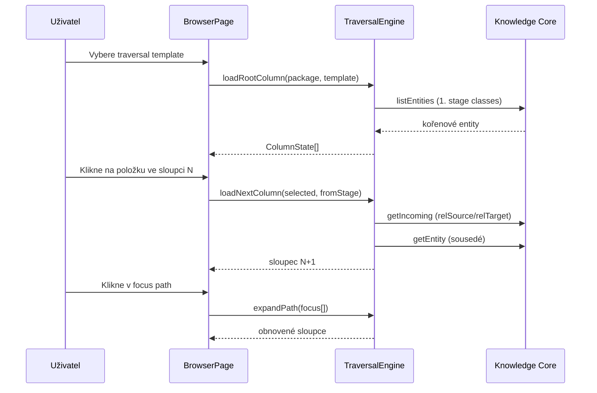

# Koncept procházení grafem — IT Map column browser

**Stav:** Aktualizováno po implementaci KC traversal profilu (srpen 2026)  
**Kontext:** IT Map — sloupcový browser, traversal templates, Knowledge Core

**Související dokumenty:**

- [`koncept-metodiky a aplikace.md`](koncept-metodiky%20a%20aplikace.md) — principy UI a vrstvené procházení
- [`implementacni-plan-traversal-metadata.md`](implementacni-plan-traversal-metadata.md) — implementační plán a stav
- [`funkcni-specifikace.md`](funkcni-specifikace.md) — funkční specifikace aplikace

---

## 1. Základní princip

> **Model je knowledge graph. Sloupcové vrstvy nejsou model — jsou pouze řízený způsob traversal toho grafu.**

Stejná data v Knowledge Core, jiná „čočka“ = jiný **traversal template**. Uživatel nevidí celý graf; postupně odkrývá další vrstvu podle výběru v předchozím sloupci (progressive disclosure), podobně jako macOS Finder v column mode.

Implementace:

- **Data a vztahy** — instance v org package v KC
- **Metamodel** — balíček `archimate-lite` (třídy, properties, enumy, AllowedRelationship)
- **Navigace** — `NavigationProfileResolver` načítá `Ui*` profil z KC; fallback `FALLBACK_TEMPLATES` v `templates.ts`

---

## 2. Architektura (tři vrstvy)

```text
Knowledge Core (data)          archimate-lite (metamodel)        IT Map (aplikace)
─────────────────────          ──────────────────────────        ─────────────────
instance organizace            třídy, properties, enumy          TraversalEngine
vztahy (Composition, …)        AllowedRelationship               NavigationProfileResolver
actorKind, associationKind…    UiNavigationProfile (2.3.0)       TraversalEngine + /navigation UI
```

| Vrstva | Odpovídá na otázku |
|--------|-------------------|
| KC instance | *Co* je v modelu organizace |
| archimate-lite | *Jaké typy* a *jaká pravidla* platí + UI traversal profil |
| IT Map resolver | *Jak* se po grafu prochází v UI (merge systém + org) |

---

## 3. Konfigurace navigace

Topologie navigace je v KC jako policy data (`UiNavigationProfile`, `UiTraversalTemplate`, `UiStage`, `UiTransition`, `UiAddAction`) v balíčku `archimate-lite` ≥ 2.3.0. Výchozí seed odpovídá dříve hardcoded šablonám v `src/domain/templates.ts` (`FALLBACK_TEMPLATES`).

Org package může připojit vlastní profil přes property `orgNavigationProfile` na package-root. Editace: stránka **Navigace** (`/navigation`) — viz [§ 3.4](#34-vlastní-org-profil--postup-z-ui).

### 3.1 Traversal templates (3 výchozí)

| Template | Kód | Kořen sloupce | Hloubka |
|----------|-----|---------------|---------|
| **Business exploration** (default) | `business-exploration` | Organizace (`BusinessActor` dept) | 12 sloupců až po lokality/síť |
| **Application impact** | `application-impact` | Aplikace | 5 sloupců zpět k organizaci |
| **Infrastructure** | `infrastructure` | Uzly | 6 sloupců |

Každá šablona (`TraversalTemplate`) definuje tři části:

#### Stages (sloupce) — `StageDef`

| Pole | Význam |
|------|--------|
| `code` | Identifikátor stage |
| `labelCs` | Český název sloupce v UI |
| `classes[]` | ArchiMate třídy zobrazené v tomto sloupci |
| `actorKinds[]` | Volitelný soft filtr pro `BusinessActor` (`department` / `person` / `external`) |
| `filter` | Volitelný filtr na property (např. `actorKind=department` pro kořen) |

#### Transitions (přechody) — `TransitionDef`

| Pole | Význam |
|------|--------|
| `from` → `to` | Mezi kterými sloupci |
| `relationship` | Typ vztahu (`Composition`, `Serving`, `Access`, …) |
| `direction` | `model` = směr ArchiMate source→target; `inverse` = opačný směr |
| `edgeLabelCs` | Popisek hrany v UI („Podporováno“, „Realizováno“…) |
| `requireProperty` | Volitelný filtr na property vztahu — implementováno v `TraversalEngine` |

#### Add actions — `AddActionDef`

| Pole | Význam |
|------|--------|
| `stage` | Ve kterém sloupci je akce dostupná |
| `createsClass` | Jakou ArchiMate třídu vytvoří |
| `defaults` | Výchozí properties na nové entitě |
| `derivesRelationship` | Automaticky vytvořený vztah k vybrané entitě |
| `relationshipDirection` | `from-selected-to-new` nebo `from-new-to-selected` |
| `relationshipDefaults` | Výchozí properties na vztahu (např. `associationKind`, `accessMode`) |

### 3.2 TraversalEngine (algoritmus)

`TraversalEngine` v `src/domain/traversal.ts`:

1. **Kořen** — první stage template; načte entity daných tříd z aktivního org package.
2. **Další sloupec** — najde transitions z aktuálního stage, projde vztahy vybrané entity, filtruje cílové třídy podle `toStage.classes`.
3. **Směr průchodu** — `model`: pokud jsem source, jdu k target; `inverse`: pokud jsem target, jdu k source (typicky u `Serving`).
4. **Progressive disclosure (výchozí)** — vždy ukáže první **viditelný** sloupec v pořadí šablony s definovanou transition, i když je prázdný.
5. **Skryté sloupce** — uživatel může sloupec dočasně skrýt (viz [§ 3.5](#35-dočasné-skrytí-sloupce-v-browseru)); engine je při načítání přeskočí. Seznam skrytých stages se persistuje v URL toku.

### 3.3 Hardcoded v UI

- České domain labely (`domainLabelFor`) — „Osoba“, „Organizační jednotka“, …
- Vykreslení sloupců, focus path, Inspector (`BrowserPage`, `Inspector`)
- Výběr template v dropdownu na stránce Browser

### 3.4 Vlastní org profil — postup z UI

Stránka **Navigace** (`/navigation`, položka v horní liště) slouží k připojení org profilu a k úpravě šablon. Implementace: `NavigationConfigPage` + `NavigationProfileService`.

#### Předpoklady

| Podmínka | Proč |
|----------|------|
| Připojený KC a načtené schema | Bez `archimate-lite` ≥ 2.3.0 chybí `Ui*` třídy a systémový seed |
| Aktivní **org package** (Settings) | Profil se váže na package-root vybrané organizace |
| **Manuální ChangeSet** v horní liště | Všechny zápisy (duplikace, připojení, úpravy stages/…) jdou přes ChangeSet; bez něj je stránka jen pro čtení |

#### Přehled profilu (horní sekce stránky)

Zobrazuje:

- **Systémový profil** — seed z `archimate-lite` (`isSystemDefault = true`), jen pro čtení
- **Org profil** — entita `UiNavigationProfile` odkazovaná z package-root přes `orgNavigationProfile`, nebo „— (výchozí systémový)“ pokud odkaz chybí

Tlačítka:

| Akce | Efekt | ChangeSet |
|------|-------|-----------|
| **Použít výchozí** | Odebere `orgNavigationProfile` z package-root; Browser používá jen systémový profil | ano |
| **Duplikovat výchozí do org** | Vytvoří kopii systémového profilu v org balíčku (všechny 3 šablony + stages/transitions/add actions), nastaví `parentProfile` na systémový profil a automaticky ho připojí k org | ano, vyžaduje ChangeSet |
| **Připojit existující profil** | Výběr libovolného `UiNavigationProfile` z KC (dropdown) + **Připojit** — profil může být v jiném balíčku | ano, vyžaduje ChangeSet |

Duplikace vytvoří entitu s kódem `{org-package}-nav` (např. `org-demo-nav`) a popiskem `{název org} — navigace`.

#### Seznam šablon

Pod přehledem profilu jsou všechny **resolved** šablony (merge systém + org):

| Badge | Význam |
|-------|--------|
| `systém` | Šablona pochází jen ze systémového profilu |
| `org` | Šablona je definovaná v org profilu |
| `override` | Org šablona má stejný `templateCode` jako systémová a přepisuje ji |

U každé šablony:

- klik na název → otevře **editor** dole na stránce
- **Browser** → přepne aktivní template v Browseru a otevře `/` pro rychlý smoke test

#### Editor šablony

Po výběru šablony se zobrazí editor se záložkami **Stages**, **Transitions**, **Add actions**.

**Důležité:** editovat lze jen šablony, jejichž `packageCode` odpovídá aktivnímu org balíčku. U systémových šablon se zobrazí upozornění *„Systémová šablona je jen pro čtení. Duplikujte profil do org pro úpravy.“*

##### Stages (sloupce)

Seznam stages vlevo, formulář vpravo. Pole:

| Pole UI | KC property | Popis |
|---------|-------------|-------|
| `stageCode` | `stageCode` | Identifikátor stage |
| `columnLabelCs` | `columnLabelCs` | Název sloupce v Browseru |
| `stageOrder` | `stageOrder` | Pořadí sloupce |
| `targetClasses` | `targetClasses` | Multi-select ArchiMate tříd ve sloupci |
| `actorKinds` | `actorKinds` | CSV filtr pro `BusinessActor` (`department,person,external`) |

Akce: **Uložit stage**, **Smazat**, **Nový** (prázdný formulář pro nový stage).

##### Transitions (přechody)

Tabulka přechodů (filtrovaná dle vybraného stage v panelu Stages) + formulář:

| Pole UI | KC property | Popis |
|---------|-------------|-------|
| `fromStage` / `toStage` | `fromStage`, `toStage` | Odkazy na `UiStage` |
| `relationshipClass` | `relationshipClass` | Typ vztahu (`Assignment`, `Serving`, …) |
| `traverseDirection` | `traverseDirection` | `model` nebo `inverse` |
| `uiEdgeLabelCs` | `uiEdgeLabelCs` | Popisek hrany v UI |
| `requireProperty` | `requireProperty` | Volitelný JSON filtr na property vztahu |

##### Add actions

Seznam akcí menu „+ Add“ pro vybraný stage + formulář (`actionCode`, `domainLabelCs`, `createsClass`, `derivesRelationship`, …).

#### Validace

Sekce **Validace** zobrazí varování/chyby z `NavigationProfileService.validateProfile` (např. neplatný vztah, chybějící stage). Prohlížet lze i bez ChangeSetu.

#### Typický workflow: vlastní navigace pro organizaci

```text
1. Settings → vybrat org package
2. Horní lišta → zapnout manuální ChangeSet
3. Navigace (/navigation) → „Duplikovat výchozí do org“
4. Kliknout na šablonu (badge „org“ nebo „override“)
5. Upravit stages / transitions / add actions → Uložit
6. „Browser“ u šablony → ověřit chování
7. ChangeSet commitnout do KC
```

#### Merge systémového a org profilu

IT Map při načtení sloučí oba profily (`NavigationProfileResolver`):

1. Načte systémový profil (`isSystemDefault = true` v `archimate-lite`).
2. Pokud package-root má `orgNavigationProfile`, načte org profil (libovolný KC balíček).
3. Šablony se sloučí podle `templateCode` — org přepíše systém u stejného kódu.
4. Org profil může deklarovat `parentProfile` → dědí chybějící šablony ze systému (viz příklad v [`implementacni-plan-traversal-metadata.md`](implementacni-plan-traversal-metadata.md) § 8).

Po každé změně profilu aplikace invaliduje cache a znovu načte resolved profil (`reloadNavigationProfile`).

#### Alternativa: profil přímo v KC (bez UI editoru)

Stejný výsledek lze dosáhnout ručním vytvořením entit `UiNavigationProfile` + podřízených `UiTraversalTemplate` / `UiStage` / … v KC a připojením přes `orgNavigationProfile` na package-root. UI pak slouží jen k připojení existujícího profilu nebo k editaci již vytvořených šablon.

### 3.5 Dočasné skrytí sloupce v browseru

Výchozí chování zůstává **progressive disclosure** — prázdný mezisloupec se zobrazí, pokud pro něj existuje transition. Uživatel ale může sloupec **dočasně skrýt**, pokud v profilu existuje **přímá zkratka** na pozdější stage.

#### Kdy lze sloupec skrýt

| Sloupec | Podmínka |
|---------|----------|
| **Prázdný** | Existuje přímá transition z focus stage na nějaký **pozdější** sloupec v pořadí šablony (zkratka v profilu). |
| **Neprázdný** | Totéž **a** cílová stage zkratky má v datech alespoň jednu entitu (opora v grafu). |

Příklad: u procesu lze skrýt sloupec Biz služby, pokud existuje `processes → app-services` a (u neprázdného biz sloupce) app služby jsou v grafu napojené.

#### Akce v UI

| Akce | Kde |
|------|-----|
| **Přeskočit → {cíl}** | Tlačítko ve sloupci (pod seznamem položek) |
| **Obnovit skrytý sloupec** | Chip „Skryté sloupce“ nad sloupci toku (focus bar) |
| **↩ {název}** | V hlavičce sloupce — obnoví skryté stages **mezi** sousedními viditelnými sloupci |

Skrytí **nemění model** v KC — jde jen o dočasný pohled v daném toku (flow).

#### Persistace v URL

Skryté sloupce se ukládají do parametru flow v URL jako `h:{stageCode},{stageCode}`:

```text
/?pkg=org-demo&active=f1&f1=t:business-exploration;e:...;h:biz-services
```

Odkaz lze sdílet — příjemce uvidí stejný průchod se skrytými sloupci.

#### Implementace

| Modul | Úloha |
|-------|--------|
| `TraversalEngine.loadNextColumn` / `expandPath` | parametr `hiddenStages` — přeskočí skryté stages |
| `TraversalEngine.findSkipTarget` | zjistí, zda lze sloupec skrýt a kam vede zkratka |
| `NavigationFlow.hiddenStages` | stav toku |
| `browserUrlState` | serializace `h:` v URL |
| `FlowColumns` / `FlowBar` | tlačítka skip / obnovit |

---

## 4. Traversal templates v praxi

### Business exploration (výchozí)

Plná cesta zleva doprava:

```text
Organizace → Lidé/Role → Oblasti → Procesy → Biz služby → App služby
→ Aplikace → Data → Technologie → Uzly → Síť → Lokality
```

Klíčové: u `Serving` a `Realization` je často `direction: inverse` — navigace jde proti ArchiMate šipce (např. proces je *podporován* app službou, ne naopak).

Add menu je plně definované pro všechny sloupce (organizační jednotka, osoba, role, proces, aplikace, síť, …).

### Application impact

Od aplikace zpět k business kontextu:

```text
Aplikace → App služby → Procesy/funkce → Role → Organizace
```

Add menu prázdné — template je primárně pro analýzu dopadu.

### Infrastructure

Od hardwaru k aplikacím:

```text
Uzly → Software → Aplikace → Služby → Síť → Lokality
```

Add menu prázdné — template je primárně pro infra pohled.

---

## 5. Co je v metadatech (Knowledge Core)

### 5.1 Metamodel `archimate-lite` — načítá se při startu

| Co | K čemu slouží v procházení |
|----|---------------------------|
| **Třídy** (`BusinessActor`, `Serving`, …) | Mapování IRI ↔ local name; filtrování entit ve sloupci |
| **Properties** (`relSource`, `relTarget`, `actorKind`, …) | Čtení vztahů a filtrů |
| **Enumy** | `actorKind`, `ownership`, `associationKind`, `networkKind`, `networkRole`, `accessMode`, `flowKind`, … |
| **AllowedRelationship** | Validace při zápisu (ne přímo pro traversal, ale stejné typy vztahů) |

Schema resolver (`src/kc/schema.ts`) načte třídy, properties, enumy a matici povolených vztahů z KC balíčku `archimate-lite`.

### 5.2 Instance data organizace — filtry a sémantika

Traversal **čte** tyto properties z instancí v org package:

| Property | Efekt v browseru |
|----------|------------------|
| `actorKind` | Rozdělení `BusinessActor` do sloupců Organizace vs. Lidé/Role |
| `associationKind` | Sémantika `Association` (síť, umístění…) — při Add i v Inspectoru |
| `accessMode` | Default při vytváření `Access` vztahu |
| `ownership`, `networkKind`, `networkRole` | Defaults při Add, zobrazení v Inspectoru |

### 5.3 Navigační profil v metadatech (`archimate-lite` ≥ 2.3.0)

Traversal topologie je policy data v KC — třídy `UiNavigationProfile`, `UiTraversalTemplate`, `UiStage`, `UiTransition`, `UiAddAction`. Specifikace datového modelu: [`navrh-ui-konfiguracni-vrstvy.md`](navrh-ui-konfiguracni-vrstvy.md); implementační detaily: [`implementacni-plan-traversal-metadata.md`](implementacni-plan-traversal-metadata.md).

| Co | Kde |
|----|-----|
| Výchozí profil (3 šablony) | Seed v balíčku `archimate-lite`, `isSystemDefault = true` |
| Org vlastní profil | Instance `UiNavigationProfile` v org (nebo jiném) balíčku |
| Vazba org → profil | Property `orgNavigationProfile` na package-root (`kc-base:Package`) |
| Editace z UI | Stránka `/navigation` — viz [§ 3.4](#34-vlastní-org-profil--postup-z-ui) |

Property `uiStageGroup` na ArchiMate třídách (varianta A z návrhu) **není** implementováno.

---

## 6. Možnosti nastavení

### 6.1 V UI aplikace (dnes)

| Nastavení | Kde | Efekt |
|-----------|-----|-------|
| **Traversal template** | Browser → dropdown „Traversal“ | Vybere úhel pohledu (business / app impact / infra) |
| **Skrytí sloupce** | Browser → *Přeskočit → …* ve sloupci | Dočasně skryje stage, pokud existuje zkratka v profilu |
| **Obnovení sloupce** | Chip *Skryté sloupce* nebo ↩ v hlavičce sloupce | Vrátí skrytý stage do pohledu |
| **Org package** | Settings | Který KC balíček se prochází |
| **Auth KC** | Settings | Připojení ke Knowledge Core |
| **Navigační profil** | Navigace (`/navigation`) | Připojení org profilu, editace stages / transitions / add actions |
| **Výchozí / org profil** | Navigace → přehled profilu | Duplikace, připojení existujícího, návrat k systémovému |

Podrobný postup pro vlastní profil: [§ 3.4](#34-vlastní-org-profil--postup-z-ui).

### 6.2 V datech (Knowledge Core)

| Nastavení | Kde | Efekt |
|-----------|-----|-------|
| `Ui*` traversal profil | `archimate-lite` seed + volitelně org package | Pořadí sloupců, přechody, Add menu |
| `orgNavigationProfile` | package-root aktivního org | Který profil platí pro organizaci |
| `actorKind` na BusinessActor | instance | Do kterého sloupce actor spadne |
| Vztahy mezi entitami | instance | Co se ukáže v dalším sloupci |
| Enum hodnoty | archimate-lite catalog | Možnosti v Add dialogu / Inspectoru |

### 6.3 Pouze úpravou kódu

- České domain labely entit (`domainLabelFor`) mimo popisky v profilu
- Vykreslení sloupce, focus path, layout Browseru
- Algoritmus `TraversalEngine` (skip prázdných sloupců, progressive disclosure)
- Vestavěný fallback `FALLBACK_TEMPLATES` — použije se, pokud KC profil chybí

---

## 7. Tok procházení (diagram)



---

## 8. Implementace (srpen 2026)

Plná varianta B z [`navrh-ui-konfiguracni-vrstvy.md`](navrh-ui-konfiguracni-vrstvy.md) je implementována v `archimate-lite` 2.3.0 a IT Map:

| Modul | Soubor | Účel |
|-------|--------|------|
| Resolver | `src/domain/navigationProfile.ts` | Načtení a merge systémového + org profilu |
| Loader | `src/domain/navigationProfileLoader.ts` | KC dotazy na `Ui*` entity |
| Mapper | `src/domain/navigationProfileMapper.ts` | `Ui*` → `TraversalTemplate` |
| Service | `src/domain/navigationProfileService.ts` | CRUD pravidel přes ChangeSet |
| UI | `src/pages/NavigationConfigPage.tsx` | Stránka `/navigation` — viz [§ 3.4](#34-vlastní-org-profil--postup-z-ui) |

Vestavěný fallback v `FALLBACK_TEMPLATES` zůstává pro offline dev, pokud KC profil chybí.

---

## 9. Shrnutí

| Aspekt | Kde je dnes |
|--------|-------------|
| Struktura sloupců a přechodů | KC `Ui*` profil (`archimate-lite` 2.3.0 seed) + org override |
| Algoritmus průchodu | `src/domain/traversal.ts` |
| Načtení šablon | `src/domain/navigationProfile.ts` |
| Editace pravidel | `/navigation` |
| Dočasné skrytí sloupců | Browser — skip / obnovit, persist `h:` v URL |
| Typy entit a vztahů | Metamodel `archimate-lite` v KC |
| Filtry na instancích (`actorKind`, …) | Data v org package |
| Validace vztahů | `AllowedRelationship` v KC |
| Fallback bez KC profilu | `FALLBACK_TEMPLATES` v `templates.ts` |

**Jednou větou:** Navigace je konfigurovatelná metadata v KC; IT Map je interpretuje, org ji může přepsat vlastním profilem, a fallback v kódu kryje chybějící profil.
