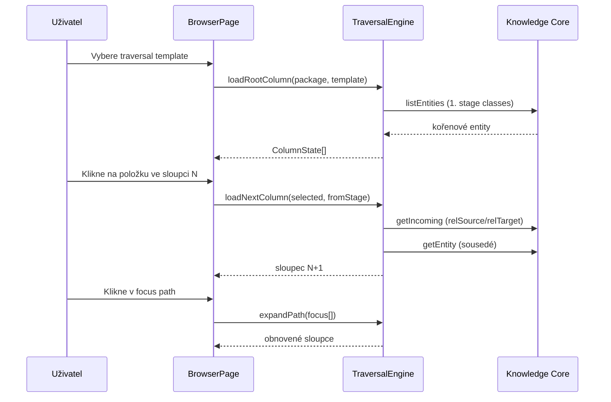

# Koncept procházení grafem — IT Map column browser

**Stav:** Aktualizováno po implementaci KC traversal profilu (srpen 2026)  
**Kontext:** IT Map — sloupcový browser, traversal templates, Knowledge Core

**Související dokumenty:**

- [`koncept-metodiky a aplikace.md`](koncept-metodiky%20a%20aplikace.md) — principy UI a vrstvené procházení
- [`implementacni-plan-traversal-metadata.md`](implementacni-plan-traversal-metadata.md) — implementační plán a stav
- [`funkcni-specifikace.md`](funkcni-specifikace.md) — funkční specifikace aplikace

---

## 1. Základní princip

> **Model je knowledge graph. Sloupcové vrstvy nejsou model — jsou pouze řízený způsob traversal toho grafu.**

Stejná data v Knowledge Core, jiná „čočka“ = jiný **traversal template**. Uživatel nevidí celý graf; postupně odkrývá další vrstvu podle výběru v předchozím sloupci (progressive disclosure), podobně jako macOS Finder v column mode.

Implementace:

- **Data a vztahy** — instance v org package v KC
- **Metamodel** — balíček `archimate-lite` (třídy, properties, enumy, AllowedRelationship)
- **Navigace** — `NavigationProfileResolver` načítá `Ui*` profil z KC; fallback `FALLBACK_TEMPLATES` v `templates.ts`

---

## 2. Architektura (tři vrstvy)

```text
Knowledge Core (data)          archimate-lite (metamodel)        IT Map (aplikace)
─────────────────────          ──────────────────────────        ─────────────────
instance organizace            třídy, properties, enumy          TraversalEngine
vztahy (Composition, …)        AllowedRelationship               NavigationProfileResolver
actorKind, associationKind…    UiNavigationProfile (2.3.0)       TraversalEngine + /navigation UI
```

| Vrstva | Odpovídá na otázku |
|--------|-------------------|
| KC instance | *Co* je v modelu organizace |
| archimate-lite | *Jaké typy* a *jaká pravidla* platí + UI traversal profil |
| IT Map resolver | *Jak* se po grafu prochází v UI (merge systém + org) |

---

## 3. Konfigurace navigace

Topologie navigace je v KC jako policy data (`UiNavigationProfile`, `UiTraversalTemplate`, `UiStage`, `UiTransition`, `UiAddAction`) v balíčku `archimate-lite` ≥ 2.3.0. Výchozí seed odpovídá dříve hardcoded šablonám v `src/domain/templates.ts` (`FALLBACK_TEMPLATES`).

Org package může připojit vlastní profil přes property `orgNavigationProfile` na package-root. Editace: stránka **Navigace** (`/navigation`).

### 3.1 Traversal templates (3 výchozí)

| Template | Kód | Kořen sloupce | Hloubka |
|----------|-----|---------------|---------|
| **Business exploration** (default) | `business-exploration` | Organizace (`BusinessActor` dept) | 12 sloupců až po lokality/síť |
| **Application impact** | `application-impact` | Aplikace | 5 sloupců zpět k organizaci |
| **Infrastructure** | `infrastructure` | Uzly | 6 sloupců |

Každá šablona (`TraversalTemplate`) definuje tři části:

#### Stages (sloupce) — `StageDef`

| Pole | Význam |
|------|--------|
| `code` | Identifikátor stage |
| `labelCs` | Český název sloupce v UI |
| `classes[]` | ArchiMate třídy zobrazené v tomto sloupci |
| `actorKinds[]` | Volitelný soft filtr pro `BusinessActor` (`department` / `person` / `external`) |
| `filter` | Volitelný filtr na property (např. `actorKind=department` pro kořen) |

#### Transitions (přechody) — `TransitionDef`

| Pole | Význam |
|------|--------|
| `from` → `to` | Mezi kterými sloupci |
| `relationship` | Typ vztahu (`Composition`, `Serving`, `Access`, …) |
| `direction` | `model` = směr ArchiMate source→target; `inverse` = opačný směr |
| `edgeLabelCs` | Popisek hrany v UI („Podporováno“, „Realizováno“…) |
| `requireProperty` | Volitelný filtr na property vztahu — implementováno v `TraversalEngine` |

#### Add actions — `AddActionDef`

| Pole | Význam |
|------|--------|
| `stage` | Ve kterém sloupci je akce dostupná |
| `createsClass` | Jakou ArchiMate třídu vytvoří |
| `defaults` | Výchozí properties na nové entitě |
| `derivesRelationship` | Automaticky vytvořený vztah k vybrané entitě |
| `relationshipDirection` | `from-selected-to-new` nebo `from-new-to-selected` |
| `relationshipDefaults` | Výchozí properties na vztahu (např. `associationKind`, `accessMode`) |

### 3.2 TraversalEngine (algoritmus)

`TraversalEngine` v `src/domain/traversal.ts`:

1. **Kořen** — první stage template; načte entity daných tříd z aktivního org package.
2. **Další sloupec** — najde transitions z aktuálního stage, projde vztahy vybrané entity, filtruje cílové třídy podle `toStage.classes`.
3. **Směr průchodu** — `model`: pokud jsem source, jdu k target; `inverse`: pokud jsem target, jdu k source (typicky u `Serving`).
4. **Skip prázdných mezistupňů** — pokud mezisloupec nemá data, engine zkusí další stage.
5. **Progressive disclosure** — vždy ukáže nejbližší další sloupec, i když je prázdný.

### 3.3 Hardcoded v UI

- České domain labely (`domainLabelFor`) — „Osoba“, „Organizační jednotka“, …
- Vykreslení sloupců, focus path, Inspector (`BrowserPage`, `Inspector`)
- Výběr template v dropdownu na stránce Browser

---

## 4. Traversal templates v praxi

### Business exploration (výchozí)

Plná cesta zleva doprava:

```text
Organizace → Lidé/Role → Oblasti → Procesy → Biz služby → App služby
→ Aplikace → Data → Technologie → Uzly → Síť → Lokality
```

Klíčové: u `Serving` a `Realization` je často `direction: inverse` — navigace jde proti ArchiMate šipce (např. proces je *podporován* app službou, ne naopak).

Add menu je plně definované pro všechny sloupce (organizační jednotka, osoba, role, proces, aplikace, síť, …).

### Application impact

Od aplikace zpět k business kontextu:

```text
Aplikace → App služby → Procesy/funkce → Role → Organizace
```

Add menu prázdné — template je primárně pro analýzu dopadu.

### Infrastructure

Od hardwaru k aplikacím:

```text
Uzly → Software → Aplikace → Služby → Síť → Lokality
```

Add menu prázdné — template je primárně pro infra pohled.

---

## 5. Co je v metadatech (Knowledge Core)

### 5.1 Metamodel `archimate-lite` — načítá se při startu

| Co | K čemu slouží v procházení |
|----|---------------------------|
| **Třídy** (`BusinessActor`, `Serving`, …) | Mapování IRI ↔ local name; filtrování entit ve sloupci |
| **Properties** (`relSource`, `relTarget`, `actorKind`, …) | Čtení vztahů a filtrů |
| **Enumy** | `actorKind`, `ownership`, `associationKind`, `networkKind`, `networkRole`, `accessMode`, `flowKind`, … |
| **AllowedRelationship** | Validace při zápisu (ne přímo pro traversal, ale stejné typy vztahů) |

Schema resolver (`src/kc/schema.ts`) načte třídy, properties, enumy a matici povolených vztahů z KC balíčku `archimate-lite`.

### 5.2 Instance data organizace — filtry a sémantika

Traversal **čte** tyto properties z instancí v org package:

| Property | Efekt v browseru |
|----------|------------------|
| `actorKind` | Rozdělení `BusinessActor` do sloupců Organizace vs. Lidé/Role |
| `associationKind` | Sémantika `Association` (síť, umístění…) — při Add i v Inspectoru |
| `accessMode` | Default při vytváření `Access` vztahu |
| `ownership`, `networkKind`, `networkRole` | Defaults při Add, zobrazení v Inspectoru |

### 5.3 Co v metadatech zatím není

Navigační profil (`UiNavigationProfile`, `UiStage`, `UiTransition`, …) je zatím jen **návrh** — viz [`navrh-ui-konfiguracni-vrstvy.md`](navrh-ui-konfiguracni-vrstvy.md), plánované pro archimate-lite 2.2.0.

Traversal templates se z KC **nenačítají**. Property `uiStageGroup` na třídách není implementováno.

---

## 6. Možnosti nastavení

### 6.1 V UI aplikace (dnes)

| Nastavení | Kde | Efekt |
|-----------|-----|-------|
| **Traversal template** | Browser → dropdown „Traversal“ | Vybere úhel pohledu (business / app impact / infra) |
| **Org package** | Settings | Který KC balíček se prochází |
| **Auth KC** | Settings | Připojení ke Knowledge Core |

### 6.2 V datech (Knowledge Core)

| Nastavení | Kde | Efekt |
|-----------|-----|-------|
| `actorKind` na BusinessActor | instance | Do kterého sloupce actor spadne |
| Vztahy mezi entitami | instance | Co se ukáže v dalším sloupci |
| Enum hodnoty | archimate-lite catalog | Možnosti v Add dialogu / Inspectoru |

### 6.3 Pouze úpravou kódu

- Pořadí a sestava sloupců
- Přechody (který vztah, jakým směrem)
- Add menu a odvozené vztahy
- Nový traversal template
- České popisky hran a typů

---

## 7. Tok procházení (diagram)



---

## 8. Implementace (srpen 2026)

Plná varianta B z [`navrh-ui-konfiguracni-vrstvy.md`](navrh-ui-konfiguracni-vrstvy.md) je implementována v `archimate-lite` 2.3.0 a IT Map:

- `NavigationProfileResolver` — načtení a merge systémového + org profilu
- `NavigationProfileService` — CRUD pravidel přes ChangeSet
- `/navigation` — UI editor stages / transitions / add actions

Vestavěný fallback v `FALLBACK_TEMPLATES` zůstává pro offline dev, pokud KC profil chybí.

---

## 9. Shrnutí

| Aspekt | Kde je dnes |
|--------|-------------|
| Struktura sloupců a přechodů | KC `Ui*` profil (`archimate-lite` 2.3.0 seed) + org override |
| Algoritmus průchodu | `src/domain/traversal.ts` |
| Načtení šablon | `src/domain/navigationProfile.ts` |
| Editace pravidel | `/navigation` |
| Typy entit a vztahů | Metamodel `archimate-lite` v KC |
| Filtry na instancích (`actorKind`, …) | Data v org package |
| Validace vztahů | `AllowedRelationship` v KC |
| Fallback bez KC profilu | `FALLBACK_TEMPLATES` v `templates.ts` |

**Jednou větou:** Navigace je konfigurovatelná metadata v KC; IT Map je interpretuje, org ji může přepsat vlastním profilem, a fallback v kódu kryje chybějící profil.
