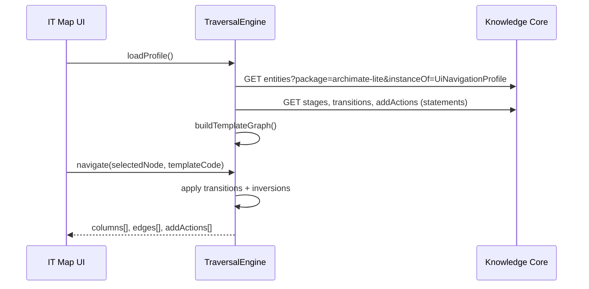

# Návrh: UI konfigurační vrstva v archimate-lite

**Stav:** Návrh k diskusi (před rozhodnutím o zařazení do 2.1.0 nebo 2.2.0)  
**Kontext:** IT Map — column browser, traversal templates, odvozování vztahů

---

## 1. Otázka

Má smysl rozšířit `archimate-lite` o **dedikovanou vrstvu modelu**, která popisuje, jak se z ArchiMate grafu **skládá UI** (sloupce, přechody, popisky, akce „Add“, inverze směru)?

Nebo má zůstat v aplikačním kódu (`TraversalEngine`, hardcoded templates)?

---

## 2. Závěr (shrnutí)

| Aspekt | Doporučení |
|--------|------------|
| **Smysluplnost** | **Ano, částečně** — pro topologii navigace a editační pravidla |
| **Přímé řízení UI** | **Ne** pro layout, styling, interakční detaily |
| **Kam umístit** | Policy data v `archimate-lite` (stejný pattern jako `AllowedRelationship`, `ExchangeSpec`) |
| **Verze** | Spíše **2.2.0** po ověření 2.1.0; nebo minimální profil už v 2.1.0 |
| **Alternativa** | Lehké anotace na třídách (`uiStageGroup`) + zbytek v kódu |

**Doporučený postup:** nejdřív dodat 2.1.0 (doménový model dle [`archimate-lite-2.1.0-rozsireni-vycet.md`](archimate-lite-2.1.0-rozsireni-vycet.md)), UI konfiguraci navrhnout detailněji a zařadit až po schválení tohoto dokumentu.

---

## 3. Co by šlo a nemělo být v metamodelu

### 3.1 Dává smysl v KC / archimate-lite

| Konfigurace | Proč v modelu |
|-------------|---------------|
| **Pořadí sloupců (stages)** | Různé traversal templates bez redeploy aplikace |
| **Přechod mezi sloupci** | Který vztah (`Assignment`, `Serving`, …) a směr (model / inverzní) |
| **UI label hrany** | „Supported by“ vs ArchiMate `Serving` |
| **Filtr cílových tříd** | Sloupec Functions → jen `BusinessFunction` |
| **Filtr na property** | Sloupec Organization → `BusinessActor` kde `actorKind=department` |
| **Add-menu možnosti** | V sloupci Roles nabídnout „Role“, ne celý ArchiMate |
| **Odvozený vztah při Add** | „Application support“ → vytvoř `ApplicationService` + `Serving` |
| **Startovní třída template** | Application impact začíná na `ApplicationComponent` |
| **Off-path kategorie** | Jaké vedlejší vztahy počítat v indikátoru |

To vše jsou **deklarativní pravidla** navázaná na ArchiMate třídy a vztahy — blízké `AllowedRelationship`.

### 3.2 Nedává smysl v metamodelu

| Konfigurace | Proč ne |
|-------------|---------|
| Rozměry sloupců, barvy, fonty | Prezentační vrstva frontendu |
| Pořadí polí v Inspectoru (Basic) | UX detail; liší se per role |
| React komponenty, routing | Aplikační kód |
| Validace formulářů (regex email) | Aplikační logika |
| i18n všech UI stringů | Aplikace + případně KC labels |
| Graph layout algoritmus | Sekundární view — implementace |

### 3.3 Hranice

```text
archimate-lite UI profil  →  CO procházet, JAKÝM vztahem, JAK to pojmenovat v UI
IT Map aplikace           →  JAK to vykreslit, JAK interagovat, cache, auth
```

---

## 4. Architektonické varianty

### Varianta A — Anotace na ArchiMate třídách (minimální)

Přidat properties na **třídy** (class entity), ne na instance:

| Property | Typ | Příklad |
|----------|-----|---------|
| `uiStageGroup` | String enum | `organization`, `business`, `application`, `technology`, `network` |
| `uiDomainLabelCs` | String | „Oblast odpovědnosti“ |
| `uiSortOrder` | Integer | pořadí v rámci stage group |

**Traversal template** = seřazení stage groups v kódu aplikace.

| Pro | Proti |
|-----|-------|
| Minimální zásah do catalog | Templates stále hardcoded |
| Každá třída nese svůj UI kontext | Nevystihuje přechody mezi sloupci |
| Snadné BC | Více template = více kódu |

**Vhodné jako:** doplněk, ne jako kompletní řešení.

---

### Varianta B — Policy data: UI Navigation Profile (doporučená)

Nové **třídy metamodelu** (policy data, instance v `archimate-lite` package — jako `AllowedRelationship`):

```text
UiNavigationProfile     — kořenový profil (1× instance: ui-profile-itmap)
UiTraversalTemplate     — šablona průchodu (business-exploration, infrastructure, …)
UiStage                 — sloupec / stage
UiTransition            — přechod mezi stages (hrana v UI grafu)
UiAddAction             — položka menu „+ Add“
UiNavigationInversion   — pravidlo inverze směru (volitelně součást UiTransition)
```

#### UiTraversalTemplate (instance)

| Property | Typ | Příklad |
|----------|-----|---------|
| `templateCode` | String | `business-exploration` |
| `isDefault` | Boolean | true |
| `startClass` | EntityReference → Class | `BusinessActor` |
| `startFilter` | String (JSON) | `{"actorKind":"department"}` |

#### UiStage (instance)

| Property | Typ | Příklad |
|----------|-----|---------|
| `stageOrder` | Integer | 3 |
| `stageCode` | String | `functions` |
| `columnLabelCs` | String | „Oblasti odpovědnosti“ |
| `targetClass` | EntityReference | `BusinessFunction` |
| `instanceFilter` | String (JSON) | volitelné |
| `parentTemplate` | EntityReference | → UiTraversalTemplate |

#### UiTransition (instance)

| Property | Typ | Příklad |
|----------|-----|---------|
| `fromStage` | EntityReference | → UiStage (roles) |
| `toStage` | EntityReference | → UiStage (functions) |
| `relationshipClass` | EntityReference | `Assignment` |
| `traverseDirection` | String enum | `model` \| `inverse` \| `both` |
| `sourceRole` | String enum | `selected` \| `incoming` \| `outgoing` |
| `uiEdgeLabelCs` | String | „Odpovídá za“ |
| `archiEdgeLabel` | String | „Assignment“ (pro tooltip) |

Příklad inverze:

```text
UiTransition:
  fromStage: processes
  toStage: app-services
  relationshipClass: Serving
  traverseDirection: inverse    # AppService serves Process → UI: Process → "Supported by" → AppService
  uiEdgeLabelCs: "Podporováno službou"
```

#### UiAddAction (instance)

| Property | Typ | Příklad |
|----------|-----|---------|
| `stage` | EntityReference | → UiStage (functions) |
| `actionCode` | String | `add-function` |
| `domainLabelCs` | String | „Oblast odpovědnosti“ |
| `createsClass` | EntityReference | `BusinessFunction` |
| `derivesRelationship` | EntityReference | `Assignment` |
| `relationshipDirection` | String | `from-selected-to-new` |
| `sortOrder` | Integer | 1 |

| Pro | Proti |
|-----|-------|
| Plně deklarativní templates | Nové třídy v archimate-lite (ne ArchiMate standard) |
| Release s metamodelom | Aplikace musí interpretovat JSON filtry |
| Konzistentní s AllowedRelationship | Složitější catalog |
| Nový template bez deploy IT Map | Riziko „programování v datech“ |
| Testovatelné: načti profil → assert stages | Potřeba UI profile loader + validátor |

**Vhodné jako:** hlavní směr pro IT Map, pokud chceme konfigurovatelnost.

---

### Varianta C — Samostatný package `itmap-ui` místo archimate-lite

Stejná struktura jako varianta B, ale v package závislém na `archimate-lite`.

| Pro | Proti |
|-----|-------|
| Čistá separace domény a UI | Další package k release/importu |
| archimate-lite zůstane generický | IT Map závisí na dvou packages |
| | Odporuje dřívějšímu rozhodnutí „vše v archimate-lite“ |

**Nedoporučeno** vzhledem k rozhodnutí centralizovat rozšíření v archimate-lite.

---

### Varianta D — KC Lens jako UI API

Definovat lens `itmap-navigation` mapující UI profil na JSON pro frontend.

| Pro | Proti |
|-----|-------|
| Čisté API pro klienta | Lens + policy data = dvě vrstvy |
| | Lens neumí složitou logiku (filtry, inverze) |

**Vhodné jako:** transportní vrstva nad variantou B, ne jako náhrada.

---

## 5. Doporučená kombinace

```text
archimate-lite 2.1.0   →  doménový model (BusinessFunction, flow, network, …)
archimate-lite 2.2.0   →  UI Navigation Profile (varianta B) + lehké uiStageGroup (varianta A)
IT Map                 →  TraversalEngine čte profil z KC; fallback na vestavěný default
```

### Minimální profil pro 2.1.0 (volitelně)

Pokud chceme UI konfiguraci hned, stačí **jen anotace** (varianta A):

- `uiStageGroup` na business/application/technology třídách
- `uiDomainLabelCs` na třídách používaných v Add dialozích

Traversal zůstane v kódu, ale sloupce se seskupí podle `uiStageGroup`.

---

## 6. Jak by aplikace profil používala



**Fallback:** pokud profil v KC chybí → vestavěný `default-profile` v aplikaci (stejná struktura).

**Validace profilu** (aplikace nebo KC shape):

- každý `UiTransition.relationshipClass` musí existovat v AllowedRelationship
- `createsClass` v UiAddAction musí být ArchiMateElement
- `stageOrder` bez mezer
- cykly v UI grafu povoleny (graf ≠ strom)

---

## 7. Rizika a mitigace

| Riziko | Mitigace |
|--------|----------|
| Programování v datech | Omezit `instanceFilter` na předdefinované klíče; složitá logika v kódu |
| Nekompatibilita verzí IT Map ↔ profil | `catalogVersion` v UiNavigationProfile; semver profilu |
| Duplicita s AllowedRelationship | UiTransition jen pro navigaci; AllowedRelationship pro validaci zápisu |
| Složitost pro administrátory | V 1. fázi seed-only profil; editace až v admin UI |
| Performance | Cache profilu; profil se mění jen při release |

---

## 8. Rozhodovací matice

| Kritérium | V kódu | Anotace (A) | UI Profile (B) |
|-----------|--------|-------------|----------------|
| Změna template bez deploy | ✗ | ✗ | ✓ |
| Jednoduchost implementace | ✓ | ✓ | ✗ |
| Sladění s KC release workflow | ✗ | ○ | ✓ |
| Testovatelnost | ✓ | ○ | ✓ |
| Riziko over-engineering | ✓ | ✓ | ✗ |
| Více tenant-specific templates | ✗ | ✗ | ○ (instance v org package?) |

---

## 9. Otevřené otázky k rozhodnutí

1. **Zařadit UI Profile do 2.1.0, nebo až 2.2.0?**  
   Doporučení: **2.2.0** — nejdřív doménový model, pak navigace.

2. **Profil globální (archimate-lite) vs. per-tenant (org package)?**  
   Doporučení: **globální seed** v archimate-lite; tenant override až později.

3. **Jaký rozsah `instanceFilter`?**  
   Doporučení: whitelist `{ "actorKind": "…", "instanceOf": "…" }` — ne volný JSONPath.

4. **Má UiAddAction nahradit RelationDeriver?**  
   Doporučení: **ano pro standardní akce**; RelationDeriver zůstane pro edge cases a validaci.

5. **Lens pro export profilu?**  
   Doporučení: volitelně `GET /v1/lenses/itmap-nav/templates/{code}` v later fázi.

---

## 10. Doporučený další krok

1. Schválit **2.1.0 výčet** ([`archimate-lite-2.1.0-rozsireni-vycet.md`](archimate-lite-2.1.0-rozsireni-vycet.md))
2. Implementovat v `knowledge-core`
3. Rozhodnout o **UI Profile (B)** vs. **anotace only (A)** pro 2.2.0
4. Pokud B: doplnit detailní catalog spec pro `Ui*` třídy a seed `ui-profile-itmap`
5. Teprve potom implementovat TraversalEngine v IT Map s načítáním profilu

---

*Dokument je podkladem k diskusi — není součástí scope 2.1.0, dokud není explicitně schválen.*
